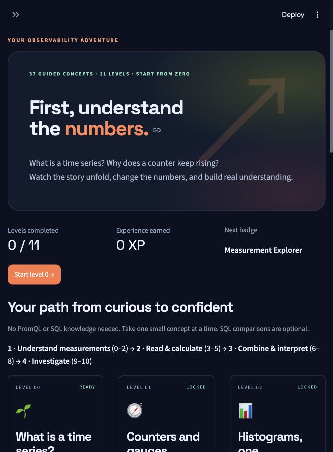
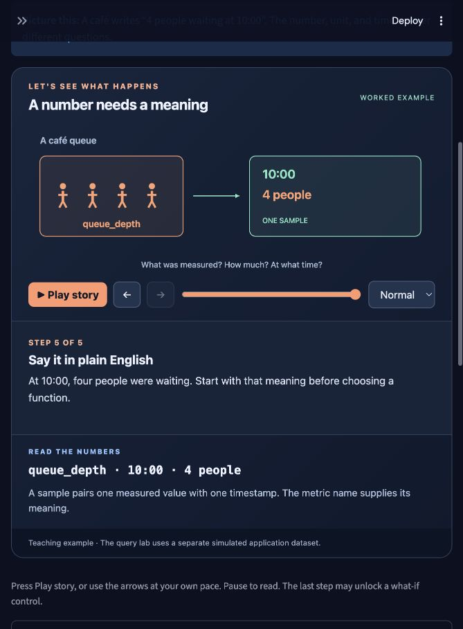
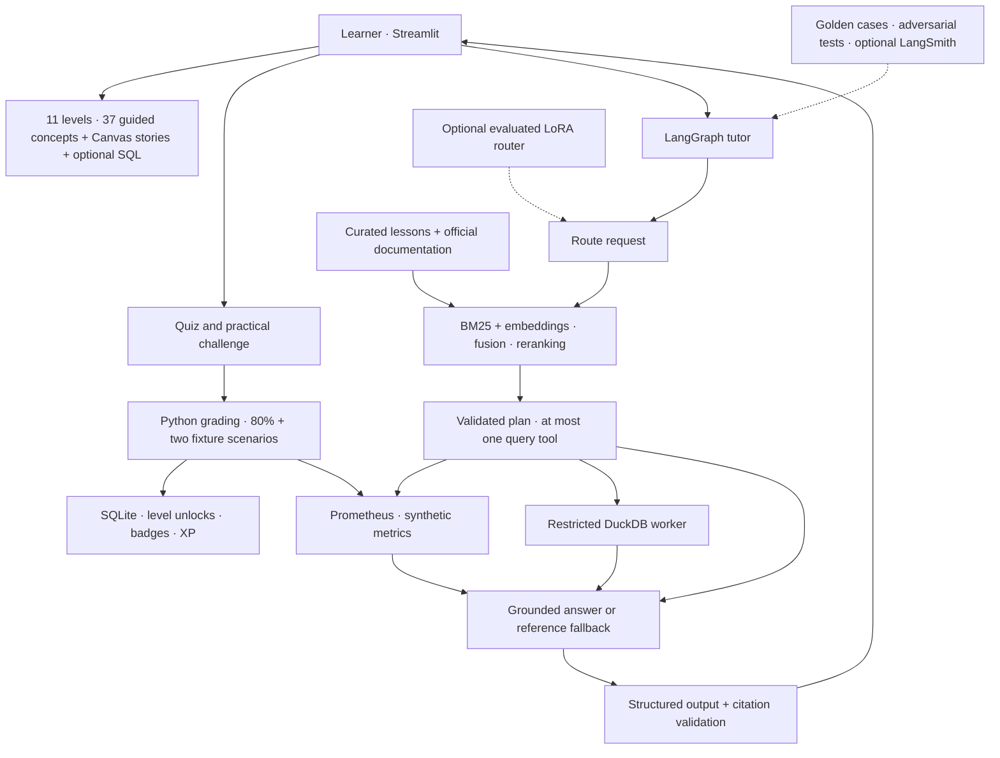

<div align="center">

# 🔥 PromQL Zero to Hero

**First, understand the numbers. Then learn to query them.**

A beginner-friendly Python + Streamlit academy. Learn what measurements mean, watch them change, and build from your first time series to an incident investigation. No PromQL or SQL background required; every concept includes an optional SQL comparison.

[](https://github.com/sivalinb/promql-zero-to-hero/actions/workflows/tests.yml)


[](LICENSE)

**11 levels · 37 guided animations · 37 practice checks · 77 quiz questions · Badges + real query labs**

</div>



## Learn by watching, comparing, and doing

Each level teaches **one small concept at a time**, in prerequisite order:

1. **Understand the meaning.** Start with a plain-English definition and an everyday café example. A queue has people waiting; a counter remembers requests served; a histogram summarizes request durations.
2. **Watch the story.** Each of the 37 concepts has five narrated steps. Play, pause, go backward, scrub, or slow the animation. Playback starts paused and respects reduced-motion preferences.
3. **Predict, then experiment.** Change the final request burst to compare `rate` and `irate`; move a request duration between histogram buckets; change a gauge sample and choose an over-time function; adjust a percentile and inspect its interpolation.
4. **Check your understanding.** An ungraded question explains why an answer is right or wrong. A takeaway and searchable word guide reinforce the idea. Reading progress saves your place without awarding a badge.
5. **Try the query.** Run a starter expression against a real Prometheus fixture and explain its result. SQL explanations appear in optional expanders, and SQL execution is an opt-in comparison in the guided practice screen.
6. **Earn the badge.** Answer five randomly selected questions and write a PromQL query. **At least 80% plus a correct result in both normal and incident scenarios** earns 100 XP and unlocks the next level. Retry without a penalty.

The first three query challenges are simple metric selections. You learn counters, gauges, observations, and cumulative buckets **before** being asked to calculate rates or percentiles. See the [complete concept map](docs/LEARNING_GUIDE.md).

Progress and conversation history are scoped to the learner. A private recovery code resumes a local profile; hosted deployments can use Streamlit OIDC sign-in. Existing v1 badges remain in **My badges → Previous course achievements**. The revised curriculum has separate progress because its level meanings and assessment questions changed.



### An example: watch a histogram grow

A bucket labeled `le="0.5"` counts observations **less than or equal to 0.5 seconds**. A 0.42s request therefore increments several cumulative buckets:

| Observation added | ≤ 0.1s | ≤ 0.5s | ≤ 1s | +Inf (all requests) |
|---|---:|---:|---:|---:|
| Start empty | 0 | 0 | 0 | 0 |
| 0.12s | 0 | 1 | 1 | 1 |
| 0.42s | 0 | 2 | 2 | 2 |
| 0.80s | 0 | 2 | 3 | 3 |
| 1.40s | 0 | 2 | 3 | 4 |

The final `_count` is **4**, `_sum` is **2.74 seconds**, and their ratio is a **0.685s mean**. Adding all bucket counts would double-count requests. A percentile needs the bucket distribution and an estimate within a boundary interval; that comes later in Level 8. These semantics follow the [Prometheus histogram guide](https://prometheus.io/docs/practices/histograms/).

## Illustrated architecture


The illustration combines the learning experience with the supporting AI workflow. The **trained router is optional**: the repository includes the complete training pipeline, but no trained adapter or claimed fine-tuning result. The app starts with a deterministic router and reference tutor.



The LLM has **no progress-writing tool**. Python alone validates attempts, checks ownership and prerequisites, compares actual engine results, and awards badges transactionally. Equivalent expressions can pass; grading does not compare query strings.

## Your path: level 0 → level 10

| Level | What you learn | SQL connection | Badge |
|---:|---|---|---|
| 0 | What is a time series? | Timestamped rows and identity | 🌱 Measurement Explorer |
| 1 | Counters and gauges | Running totals vs. current state | 🧭 Metric Type Detective |
| 2 | Histograms, one observation at a time | Conditional counts and cumulative boundaries | 📊 Bucket Builder |
| 3 | Read your first PromQL expressions | Snapshots, WHERE, and time predicates | 🔎 Query Reader |
| 4 | From totals to speed | LAG, elapsed time, and reset correction | ⚡ Rate Reasoner |
| 5 | Calculate over time | SUM, AVG, MIN, MAX, COUNT over selected rows | ⏳ Window Thinker |
| 6 | Combine series without losing meaning | GROUP BY and traffic-weighted ratios | 🧩 Aggregation Guide |
| 7 | Match labels and handle missing data | Join keys, uniqueness, and missing rows | 🔗 Label Matchmaker |
| 8 | From buckets to latency percentiles | Cumulative distributions vs. raw percentiles | 📊 Distribution Detective |
| 9 | Build trustworthy signals | Time shifts, derived history, periodic materialization | 🛡️ Signal Engineer |
| 10 | Explain an incident with evidence | Population alignment and reliability thresholds | 🏆 PromQL Hero |

**SQL is a teaching bridge, not an automatic translation promise.** `rate()` is not `AVG()`. Prometheus handles counter resets and extrapolates. `group_left` is not a SQL left outer join. Missing series are not automatically zero. Histogram quantiles estimate from buckets. Every lesson carries its own comparison limits.

## Run locally

Use Python **3.12** for the tested setup. macOS and Linux, Intel and ARM, are supported by the native bootstrap; Windows users can use Docker or WSL.

```bash
git clone https://github.com/sivalinb/promql-zero-to-hero.git
cd promql-zero-to-hero
python3.12 -m venv .venv
source .venv/bin/activate
pip install -e '.[dev]'
python scripts/bootstrap.py
streamlit run app.py
```

Open **http://localhost:8501**. If that port is occupied, add `--server.port=8517`.

The bootstrap downloads the official **Prometheus 3.15.0** binaries, checks the release SHA-256, and imports the fixtures. It starts a fixture-only engine on `127.0.0.1:9098`; no production credentials or telemetry are needed. Subsequent app launches can restart an already-installed engine. Runtime state stays in ignored `.runtime/`; binaries stay in ignored `.tools/`.

No API key is needed for lessons, animations, real query labs, quizzes, badges, or reference retrieval. Without the bootstrap, lessons remain readable but PromQL execution and badge grading require the engine.

### Docker Compose

```bash
docker compose up --build --wait
```

Open **http://localhost:8501**. Compose separates the app, Prometheus, and SQL worker. The query services have an internal network, no published ports, no provider secrets, and resource limits. Only the app can use outbound networking for a configured tutor. Progress and metrics use named volumes. See [deployment details](docs/DEPLOYMENT.md).

### Enable generated tutor answers

```bash
cp .env.example .env
```

Set `LLM_BASE_URL` (ending in `/v1`), `LLM_MODEL`, and `LLM_API_KEY` for a provider that supports the chat-completions JSON contract. Restart Streamlit. The example uses Nebius Token Factory; model availability and credentials depend on your account. A compatible local endpoint also works.

The workflow retrieves evidence, validates a one-tool plan, optionally queries fixtures, and validates the answer's cited passage IDs. Provider errors or malformed answers fall back to clearly labeled **Reference tutor** material. Valid citations do not by themselves prove factual correctness; the evaluation workflow addresses that separately. The tutor covers PromQL and related SQL within its retrieved evidence, and should acknowledge gaps.

Optional integrations:

- **Transformer retrieval:** `pip install -e '.[embeddings]'`, then set `EMBEDDING_MODEL=sentence-transformers/all-MiniLM-L6-v2`. This downloads model weights and uses persistent Chroma. The default is lightweight local LSA embeddings, accurately labeled in the evaluation output.
- **LangSmith:** set `LANGSMITH_TRACING=true`, an API key, and a project. Tracing is off by default because prompts and answers may be sent to that service.
- **LoRA router:** follow [training/README.md](training/README.md), evaluate the merged model, then configure `ROUTER_BASE_URL` and `ROUTER_MODEL`. The tutor model and routing model are separate roles.

## How the six course weeks become a product

| Week | Techniques | Where and how they are used |
|---|---|---|
| 1 | Python, Streamlit, CSV, pandas, Plotly, AI-assisted development | `app.py`, `academy/data.py`; explore synthetic CSV data, render real query results, build the learning interface. Canvas adds controllable concept animations. |
| 2 | RAG, chunking, embeddings, hybrid retrieval, fusion, reranking, citations | `academy/retrieval.py`; preserve code fences in paragraph chunks, combine BM25 and vector similarity with reciprocal-rank fusion, rerank technical terms, retain source IDs. Optional Sentence Transformers + Chroma. |
| 3 | Stateful agents, tools, structured output, failure handling, human review | `academy/tutor.py`; a bounded LangGraph routes, retrieves, plans, optionally executes one read-only query, and explains. Pydantic schemas and fallbacks constrain failures. Learners inspect sources and run examples. |
| 4 | Golden sets, baselines, code graders, LLM judges, trace analysis | `evals/`; 50 versioned cases, measured baseline/hybrid results, guardrail checks, optional model judge with a human-calibration field, and opt-in LangSmith traces. |
| 5 | Synthetic classification data, leakage-aware splits, LoRA, merge, comparison | `training/`; 50 authored seed questions, split before variations, Qwen3-1.7B-Base LoRA configs, Colab notebook, baseline/merged evaluation, optional local routing endpoint. |
| 6 | Security and guardrails | `academy/security.py`, `progress.py`, worker isolation and tests; SQL AST allowlists, query budgets, scoped memory, untrusted retrieval, citation checks, server-owned grading, and safe secret configuration. |

Course handouts informed this mapping. Their administrative/submission instructions are not application requirements, and the PDFs are not included in the public repository.

## Data and query semantics

The bundled [CSV](data/samples.csv) contains **6,100 synthetic samples**, generated by `academy/data.py`. Normal traffic and incident windows include two services, two instances each, a deliberate counter reset, errors, gauges, scrape availability, service metadata, and classic histogram buckets. No real infrastructure or learner data is committed.

- `samples` is the historical DuckDB table; `snapshot` contains samples at the chosen evaluation time.
- Evaluation times are fixed in January 2025, intentionally making demonstrations repeatable. Prometheus retention is configured to retain these historical blocks.
- PromQL gets the real Prometheus parser, evaluation semantics, and result types. SQL executes in a fresh worker with a timeout, disabled external access, and a row cap.
- Two-scenario practical checks catch many hard-coded answers, but this is an educational assessment, not a secure certification exam. Source code and answer keys are public.

## Verification and measured results

```bash
REQUIRE_PROMETHEUS_TESTS=1 pytest -q
node --test tests/animation_math.test.js  # Node 22+ for renderer arithmetic checks
python evals/run.py
# Optional provider-backed judge; incurs your provider's usage charges:
python evals/judge.py
```

Tests cover all 37 lesson screens, all 185 animation steps, numerical what-if examples, real fixture queries, equivalent expressions, rate/reset behavior, ownership and unlock rules, preserved v1 achievements, reading progress, repeat submissions, forbidden SQL, model failures and citations, and Streamlit flows. GitHub Actions also builds Compose and runs every SQL and PromQL example in both scenarios.

The checked-in [evaluation report](evals/REPORT.md) records **91.3% BM25** vs. **89.1% hybrid** expected-lesson hit@4 across 46 authored retrieval cases, plus 4/4 selected guardrail checks. **The hybrid configuration did not beat the baseline on this dataset.** Official documentation can displace lesson passages; this metric measures lesson retrieval, not generated-answer accuracy. Retain the baseline, inspect misses, and evaluate on independent human-authored questions before making quality claims. The report includes actual latency and per-case evidence.

Generated tutor quality, human judge calibration, transformer retrieval, OIDC provider integration, and GPU fine-tuning require their respective external configurations. No scores are invented for runs that have not happened.

## Project guide

```text
app.py                         Streamlit learning experience
academy/                       Engines, progress, guardrails, retrieval, tutor
academy/components/concept/    Animated HTML/Canvas teaching component
content/                       Typed curriculum and attributed reference snapshot
data/                          Reproducible synthetic CSV
scripts/                       Verified bootstrap, docs refresh, container smoke check
tests/                         Behavior, security, engine, and UI tests
evals/                         Golden cases, measured reports, optional model judge
training/                      Synthetic router data, LoRA, merge, evaluation, notebook
docs/                          Illustrated architecture, setup, security, attribution
```

Read [deployment](docs/DEPLOYMENT.md), [security boundaries](docs/SECURITY.md), [evaluation guide](evals/README.md), and [training guide](training/README.md) for the operational details.

MIT for original code and lessons. Bundled reference material retains its upstream licenses; see [NOTICE.md](NOTICE.md). This is an independent educational project.
